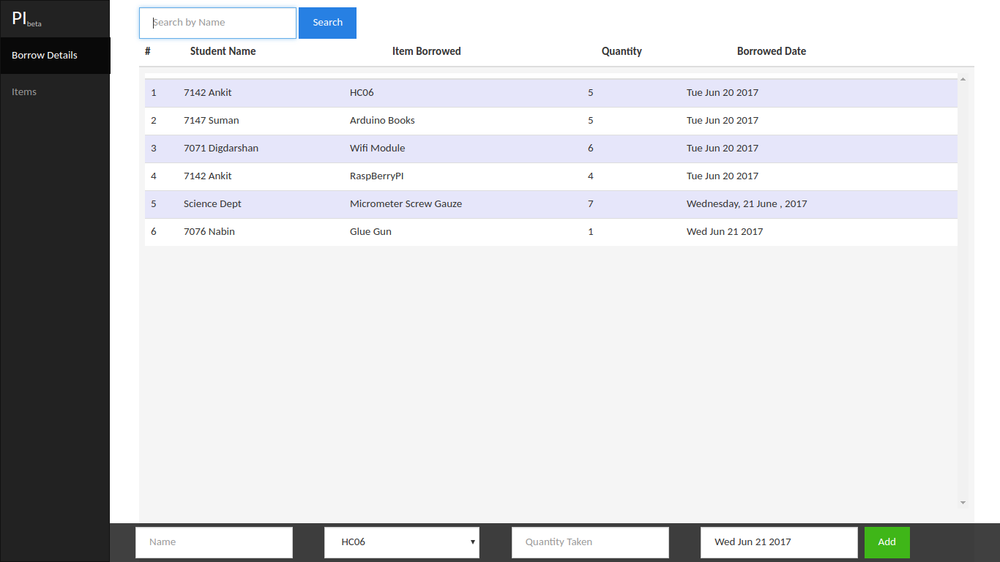
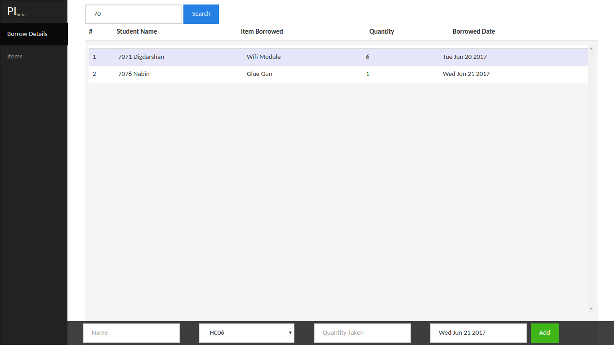
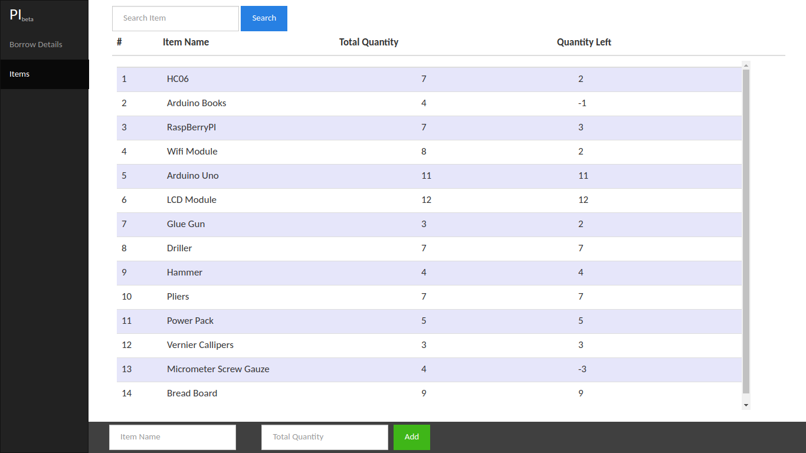
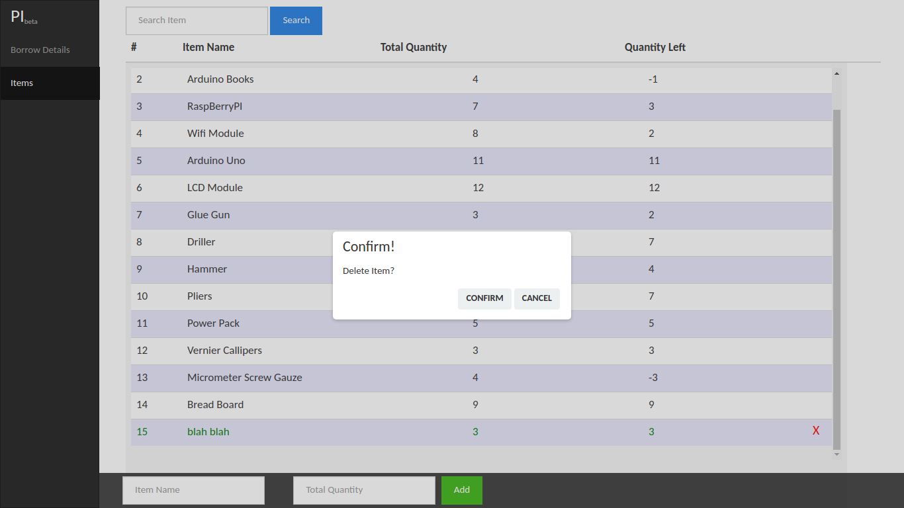

# Pi

#### Instructions on setup

- Setup `PHP` ,`web server` and `mySQL` database.
- Create a **database** named `pi`.
- Import `/database/pi.sql`  in it . *You can use softwares like **phpmyadmin** for convinience.*
- Fire up your `localhost`.

##### Quick Look: [Front-end](https://1be6-ankit.github.io/Pi/index.html)

#### Screenshots

|  |  |
| :---------------------------------: | :---------------------------------: |
|  |  |

*Created with ​:love:​ .*
